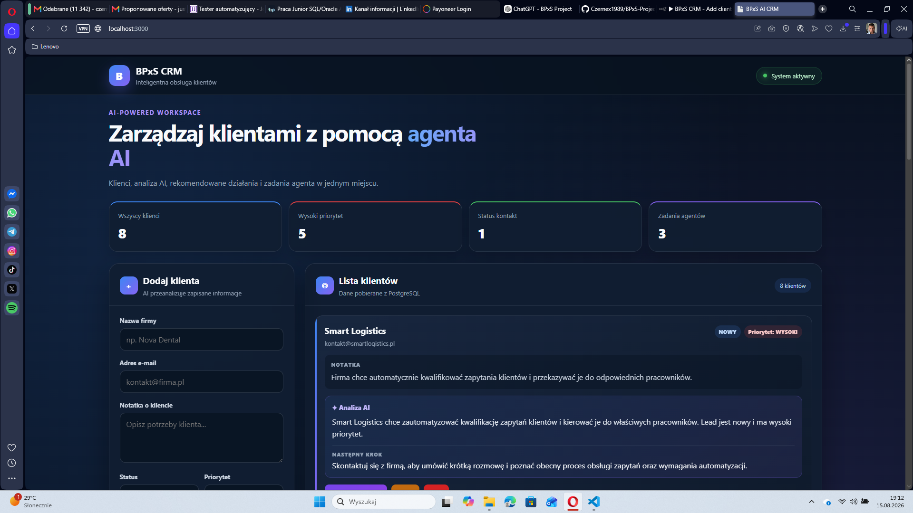

# BPxS AI CRM

BPxS AI CRM to mini system CRM zbudowany jako projekt end-to-end. Aplikacja pozwala zarządzać klientami, przechowywać dane w PostgreSQL, generować analizę klienta przez AI oraz uruchamiać agenta tworzącego zadania i aktualizującego status klienta.

Projekt łączy klasyczny CRUD, REST API, bazę danych, OpenAI API, agent loop, automatyzację n8n oraz testy Playwright E2E.

## Podgląd aplikacji



## Najważniejsze funkcje

- dodawanie klientów,
- wyświetlanie listy klientów,
- edytowanie danych klienta,
- usuwanie klientów,
- zapisywanie danych w PostgreSQL,
- generowanie podsumowania klienta przez AI,
- generowanie rekomendowanego następnego działania,
- uruchamianie agenta AI dla wybranego klienta,
- tworzenie zadań follow-up przez agenta,
- aktualizowanie statusu klienta przez agenta,
- wyświetlanie zadań agenta na karcie klienta,
- automatyczne usuwanie zadań po usunięciu klienta,
- zabezpieczenie przed wielokrotnym wysłaniem formularza,
- statystyki klientów i zadań,
- automatyczne dodawanie klientów przez workflow n8n,
- testy end-to-end w Playwright.

## Architektura

Przepływ ręcznego dodawania klienta:

```text
Frontend
   ↓
Express REST API
   ↓
OpenAI API
   ↓
PostgreSQL
   ↓
Odpowiedź API
   ↓
Aktualizacja interfejsu CRM
```

Przepływ automatyzacji n8n:

```text
n8n Form
   ↓
Edit Fields
   ↓
POST /api/clients
   ↓
Express API
   ↓
OpenAI API
   ↓
PostgreSQL
```

Przepływ agenta:

```text
Użytkownik klika „Uruchom agenta”
   ↓
POST /api/clients/:id/agent-run
   ↓
Agent pobiera dane klienta
   ↓
Model wybiera dostępne narzędzie
   ↓
Utworzenie zadania lub aktualizacja statusu
   ↓
Zapis wyniku w PostgreSQL
   ↓
Odświeżenie karty klienta
```

## Agent AI

Agent korzysta z mechanizmu function calling i może samodzielnie wybrać odpowiednią operację na podstawie danych klienta.

Dostępne narzędzia:

### `create_follow_up_task`

Tworzy zadanie follow-up dla klienta i zapisuje je w tabeli `agent_tasks`.

### `update_client_status`

Aktualizuje status klienta w tabeli `clients`.

Agent działa w ograniczonej pętli, dzięki czemu może wykonać kolejne kroki, ale nie działa bez końca.

## Technologie

### Frontend

- HTML5
- CSS3
- JavaScript
- Fetch API
- responsywny interfejs

### Backend

- Node.js
- Express
- PostgreSQL
- `pg`
- `dotenv`
- `cors`
- OpenAI SDK

### AI i automatyzacja

- OpenAI API
- function calling
- agent loop
- n8n

### Testy i narzędzia

- Playwright
- Git
- GitHub
- Visual Studio Code
- PowerShell

## Struktura projektu

```text
BPxS-Project/
├── backend/
│   ├── agent.js
│   ├── server.js
│   ├── package.json
│   ├── package-lock.json
│   └── .env
├── frontend/
│   └── index.html
├── n8n/
│   └── BPxS CRM - Add client.json
├── tests/
├── docs/
│   └── bpxs-ai-crm-dashboard.png
├── .gitignore
├── package.json
├── package-lock.json
├── README.md
└── Testing.md
```

Plik `.env` znajduje się w `.gitignore` i nie powinien być dodawany do repozytorium.

## Wymagania

Do uruchomienia projektu potrzebne są:

- Node.js,
- npm,
- PostgreSQL,
- klucz OpenAI API,
- Git,
- przeglądarka internetowa.

n8n jest potrzebne tylko do uruchomienia dodatkowej automatyzacji formularza.

## Instalacja

### 1. Sklonowanie repozytorium

```bash
git clone https://github.com/Czernex1989/BPxS-Project.git
cd BPxS-Project
```

### 2. Instalacja zależności backendu

```bash
cd backend
npm install
```

### 3. Konfiguracja zmiennych środowiskowych

W folderze `backend` utwórz plik `.env`:

```env
DB_USER=postgres
DB_HOST=localhost
DB_NAME=bpxs_crm
DB_PASSWORD=TWOJE_HASLO
DB_PORT=5432
OPENAI_API_KEY=TWOJ_KLUCZ_OPENAI
```

Nie wpisuj prawdziwego klucza ani hasła do README i nie dodawaj pliku `.env` do repozytorium.

## Konfiguracja PostgreSQL

### Tabela klientów

```sql
CREATE TABLE clients (
  id SERIAL PRIMARY KEY,
  name VARCHAR(255) NOT NULL,
  email VARCHAR(255) NOT NULL,
  note TEXT,
  status VARCHAR(50) DEFAULT 'NOWY',
  priority VARCHAR(50) DEFAULT 'ŚREDNI',
  summary TEXT,
  next_action TEXT
);
```

### Tabela zadań agenta

```sql
CREATE TABLE agent_tasks (
  id SERIAL PRIMARY KEY,
  client_id INTEGER REFERENCES clients(id) ON DELETE CASCADE,
  action TEXT NOT NULL,
  status VARCHAR(20) DEFAULT 'OPEN',
  created_at TIMESTAMP DEFAULT CURRENT_TIMESTAMP
);
```

Relacja `ON DELETE CASCADE` powoduje, że zadania przypisane do klienta są automatycznie usuwane razem z nim.

## Uruchomienie aplikacji

Przejdź do folderu backendu:

```bash
cd backend
node server.js
```

Po uruchomieniu terminal powinien wyświetlić:

```text
Backend działa na http://localhost:3000
```

Aplikacja jest dostępna pod adresem:

```text
http://localhost:3000
```

## Endpointy API

### Test połączenia z bazą

```http
GET /db-test
```

### Pobieranie klientów i ich zadań

```http
GET /clients
```

### Dodawanie klienta

```http
POST /api/clients
```

Przykładowe body:

```json
{
  "name": "Baltic Automation",
  "email": "kontakt@balticautomation.pl",
  "note": "Firma chce automatycznie obsługiwać zapytania klientów.",
  "status": "NOWY",
  "priority": "WYSOKI"
}
```

### Edycja klienta

```http
PUT /api/clients/:id
```

### Usuwanie klienta

```http
DELETE /api/clients/:id
```

### Uruchomienie agenta

```http
POST /api/clients/:id/agent-run
```

Agent analizuje wybranego klienta, może utworzyć zadanie follow-up oraz zaktualizować jego status.

## Automatyzacja n8n

Workflow znajduje się w folderze:

```text
n8n/BPxS CRM - Add client.json
```

Workflow realizuje proces:

```text
n8n Form → Edit Fields → POST /api/clients → Express API → PostgreSQL
```

Plik JSON można zaimportować do n8n przez opcję importowania workflow z pliku.

Workflow został przetestowany przez Production URL formularza n8n.

## Testy Playwright

Instalacja przeglądarki Playwright:

```bash
npx playwright install
```

Uruchomienie testów:

```bash
npx playwright test
```

Uruchomienie testów z widoczną przeglądarką:

```bash
npx playwright test --headed
```

Wyświetlenie raportu:

```bash
npx playwright show-report
```

Szczegóły testów manualnych znajdują się w pliku `Testing.md`.

## Przetestowane scenariusze

- połączenie backendu z PostgreSQL,
- pobieranie klientów z bazy,
- dodawanie klienta,
- walidacja wymaganych pól,
- walidacja adresu e-mail,
- edytowanie klienta,
- usuwanie klienta,
- zachowanie danych po ponownym uruchomieniu aplikacji,
- zabezpieczenie przed utworzeniem duplikatu przez wielokrotne kliknięcie,
- generowanie podsumowania AI,
- generowanie rekomendowanego następnego działania,
- uruchomienie agenta,
- utworzenie zadania follow-up,
- aktualizacja liczników w interfejsie,
- automatyczne usunięcie zadania razem z klientem,
- dodanie klienta przez workflow n8n.

## Bezpieczeństwo

Projekt wykorzystuje zmienne środowiskowe do przechowywania:

- klucza OpenAI API,
- hasła PostgreSQL,
- danych połączenia z bazą.

Pliki zawierające sekrety są wykluczone z repozytorium przez `.gitignore`.

Przykładowe wpisy:

```gitignore
backend/.env
.env
backend/node_modules/
node_modules/
test-results/
playwright-report/
```

Jeśli klucz API zostanie przypadkowo ujawniony, należy go natychmiast unieważnić i wygenerować nowy.

## Aktualny zakres projektu

Projekt zawiera działające MVP systemu CRM z:

- pełnym CRUD-em,
- trwałym zapisem danych,
- analizą AI,
- agentem korzystającym z narzędzi,
- automatyzacją n8n,
- testami E2E,
- responsywnym panelem użytkownika.

## Możliwe dalsze rozszerzenia

- logowanie i autoryzacja użytkowników,
- filtrowanie i wyszukiwanie klientów,
- oznaczanie zadań jako wykonane,
- historia działań agenta,
- terminy wykonania zadań,
- powiadomienia e-mail,
- wdrożenie aplikacji online,
- konteneryzacja przez Docker,
- testy API,
- limity kosztów wywołań AI.

## Autor

**Artur Czernek**

Projekt wykonany jako praktyczne ćwiczenie integracji:

- aplikacji webowej,
- REST API,
- PostgreSQL,
- sztucznej inteligencji,
- agentów AI,
- automatyzacji,
- testów end-to-end.

## Status projektu

✅ CRUD działa  
✅ PostgreSQL działa  
✅ analiza AI działa  
✅ agent loop działa  
✅ zadania agenta są zapisywane  
✅ automatyzacja n8n działa  
✅ testy Playwright działają  
✅ nowy interfejs działa  

**BPxS AI CRM jest ukończony jako działający projekt portfolio.**